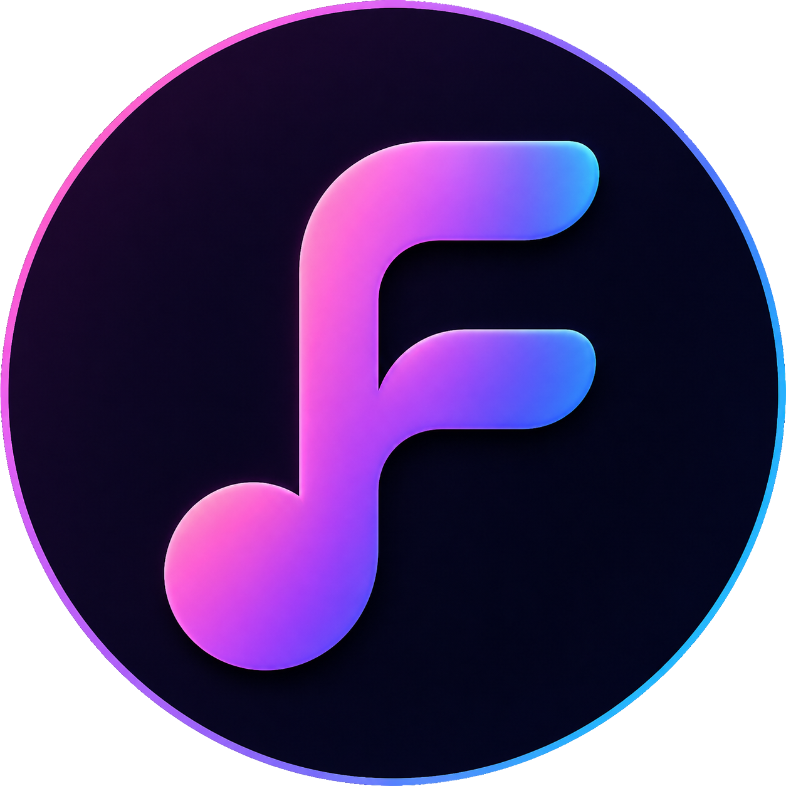

# FridaMusic

<p align="center">
  
</p>

<p align="center"><b>Reproductor musical moderno para Android</b><br/>Diseñado con Jetpack Compose, reproducción local y soporte de búsqueda con YouTube Music (InnerTube).</p>

<p align="center">
  <a href="https://github.com/jagrdev-MX/FridaMusicOF/releases"></a>
  <a href="https://github.com/jagrdev-MX/FridaMusicOF/blob/main/LICENSE"></a>
  <a href="https://github.com/jagrdev-MX/FridaMusicOF/stargazers"></a>
  <a href="https://github.com/jagrdev-MX/FridaMusicOF/network/members"></a>
  
</p>

---

## Tabla de contenido

- [Vista general](#vista-general)
- [Características principales](#características-principales)
- [Capturas](#capturas)
- [Stack tecnológico](#stack-tecnológico)
- [Estructura del proyecto](#estructura-del-proyecto)
- [Instalación y ejecución](#instalación-y-ejecución)
- [Compilar APK](#compilar-apk)
- [Contribuciones automáticas](#contribuciones-automáticas)
- [Contribuciones](#contribuciones)

---

## Vista general

**FridaMusic** es una app de música para Android que combina biblioteca local, navegación visual moderna y un flujo de reproducción inmersivo. El proyecto prioriza rendimiento, interfaz limpia y experiencia fluida en pantallas principales como Inicio, Biblioteca, Reproductor y Ajustes.

---

## Características principales

- 🎵 **Reproducción local** de canciones del dispositivo.
- 🔎 **Búsqueda avanzada** de canciones, artistas y playlists.
- 📚 **Biblioteca organizada** por canciones, playlists, álbumes y artistas.
- 🌙 **Temas visuales** (claro, oscuro y sistema).
- ⏯️ **Reproductor inmersivo** con cola, autoplay y letras.
- ⚙️ **Ajustes de experiencia**: temporizador, ecualizador, crossfade, gapless y más.

---

## Capturas

> Imágenes tomadas del propio repositorio (`capturas web/`).

### Inicio inteligente


### Biblioteca dinámica


### Reproductor inmersivo


### Ajustes minimalistas


---

## Stack tecnológico

- **Kotlin**
- **Jetpack Compose**
- **Material 3**
- **Android Media3 / ExoPlayer**
- **Gradle (KTS)**
- **Vercel Analytics / Speed Insights** (sitio web del proyecto)

---

## Estructura del proyecto

```bash
app/                 # Aplicación Android principal (UI, datos, dominio)
capturas web/        # Capturas para documentación
assets/              # Recursos auxiliares
index.html           # Página web oficial
build.gradle.kts     # Configuración raíz de Gradle
```

---

## Instalación y ejecución

### Requisitos

- Android Studio (recomendado: versión estable reciente)
- JDK 17+
- Android SDK configurado

### Clonar repositorio

```bash
git clone https://github.com/jagrdev-MX/FridaMusicOF.git
cd FridaMusicOF
```

---

## Compilar APK

```bash
# Debug
./gradlew assembleDebug

# Release
./gradlew assembleRelease
```

Los APKs se generan en `app/build/outputs/apk/`.

---

## Contribuciones automáticas

<!-- CONTRIBUTOR-STATS:START -->
_Esta sección se actualiza automáticamente con GitHub Actions._

### Repositorio oficial

**Commits humanos visibles:** 251 · **Commits de automatización:** 30

| Colaborador | Commits | % de contribución humana |
| --- | ---: | ---: |
| [@jagrdev-MX](https://github.com/jagrdev-MX) | 214 | 85.3% |
| [@juliocps25](https://github.com/juliocps25) | 37 | 14.7% |

### Forks con trabajo independiente

**Forks inspeccionados:** 0 · **Forks activos:** 0

| Fork | Rama | Commits por delante | % de actividad independiente | Último push |
| --- | --- | ---: | ---: | --- |
| Sin forks activos detectados | — | 0 | 0.0% | — |

> Los porcentajes del repositorio oficial se calculan con commits humanos visibles. Los bots se separan para no distorsionar la métrica. Los forks muestran trabajo independiente que aún no necesariamente fue integrado al proyecto principal.

Última actualización automática (UTC): `2026-05-22`
<!-- CONTRIBUTOR-STATS:END -->

---

## Contribuciones

Las contribuciones son bienvenidas. Puedes abrir un **issue** para reportes/mejoras o enviar un **pull request** con tus cambios.

1. Haz fork del repositorio
2. Crea una rama (`feature/mi-mejora`)
3. Realiza commits con Conventional Commits y, cuando aplique, usa scopes claros por track (`feat(web):`, `fix(android):`, `refactor(telegram-bot):`)
4. Abre tu pull request

---


## License
Apache License 2.0

## Branding Notice
FridaMusic TM and Frida Labs TM branding, artwork, assets, visual identity and official releases are reserved.

## Open Source
Forks and contributions are allowed under Apache 2.0, but official branding and identity remain property of the project ecosystem.

## Organization
FridaMusic TM is part of the Frida Labs TM ecosystem.

---

<p align="center">
Hecho con ❤️ para la comunidad de FridaMusic.
</p>
