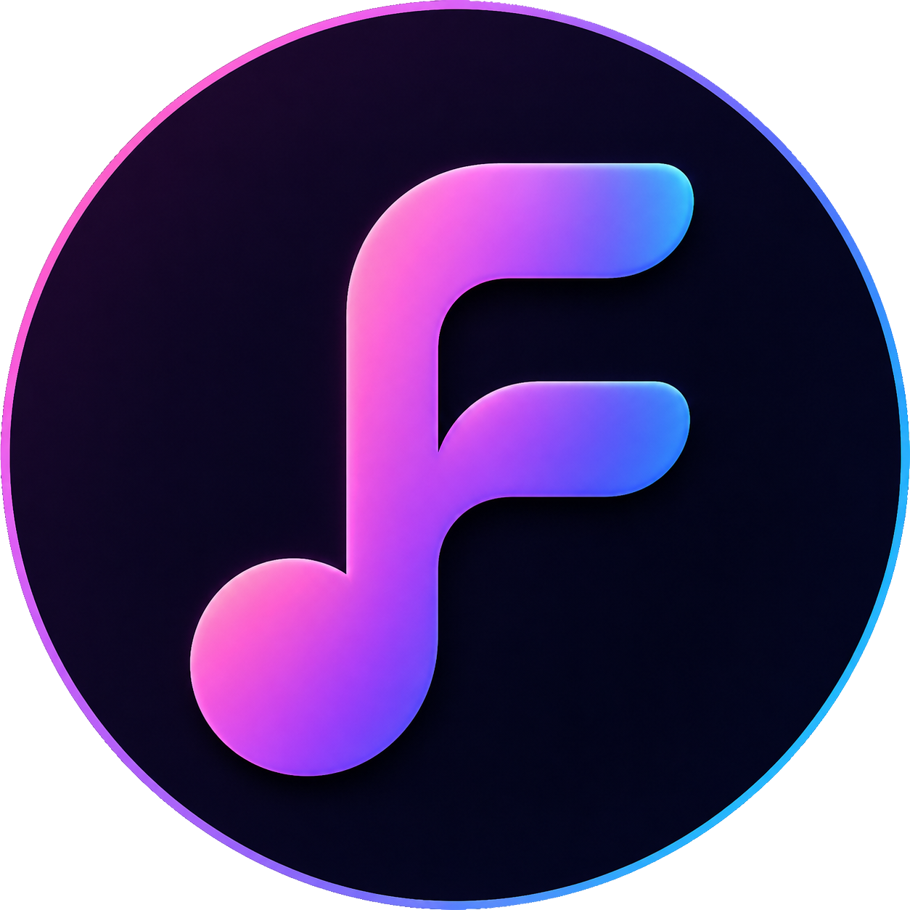

# FridaMusic

<p align="center">
  
</p>

<p align="center"><b>Reproductor musical moderno para Android</b><br/>Diseñado con Jetpack Compose, reproducción local y soporte de búsqueda con YouTube Music (InnerTube).</p>

<p align="center">
  <a href="https://github.com/jagrdev-MX/FridaMusicOF/releases"></a>
  <a href="https://github.com/jagrdev-MX/FridaMusicOF/blob/main/LICENSE"></a>
  <a href="https://github.com/jagrdev-MX/FridaMusicOF/stargazers"></a>
  <a href="https://github.com/jagrdev-MX/FridaMusicOF/network/members"></a>
  
</p>

---

## Tabla de contenido

- [Estado del repositorio y código legado](#estado-del-repositorio-y-código-legado)
- [Repository status and legacy source code](#repository-status-and-legacy-source-code)
- [Vista general](#vista-general)
- [Características principales](#características-principales)
- [Capturas](#capturas)
- [Stack tecnológico](#stack-tecnológico)
- [Estructura del proyecto](#estructura-del-proyecto)
- [Instalación y ejecución](#instalación-y-ejecución)
- [Compilar APK](#compilar-apk)
- [Contribuciones automáticas](#contribuciones-automáticas)
- [Contribuciones](#contribuciones)

---

## Estado del repositorio y código legado

**La versión v1.8.0 marca la última versión pública del FridaMusic anterior.** El código fuente disponible en la versión v1.8.0 y en versiones anteriores corresponde al proyecto legado. Este código permanece disponible como referencia histórica y como base comunitaria para forks, modificaciones y proyectos derivados, siempre conforme a la licencia Apache License 2.0 vigente y al `NOTICE` del repositorio.

El desarrollo del FridaMusic actual continuará de forma privada. Su código fuente, arquitectura, funciones nuevas, mejoras y demás avances no se publicarán en este repositorio.

Este repositorio público continuará activo principalmente para:

- Publicar novedades oficiales de FridaMusic.
- Mantener la página web pública.
- Publicar nuevas versiones mediante archivos APK.
- Compartir enlaces de descarga y disponibilidad en Google Play.
- Mantener documentación pública y avisos importantes.

La publicación de nuevos APK, binarios o releases no implica que el código fuente actualizado correspondiente vaya a publicarse.

---

## Repository status and legacy source code

**Version v1.8.0 marks the final public release of the previous FridaMusic edition.** The source code available in version v1.8.0 and earlier versions belongs to the legacy project. This code remains available as a historical reference and as a community foundation for forks, modifications, and derivative projects, always subject to the repository's current Apache License 2.0 and `NOTICE`.

The current FridaMusic project will continue to be developed privately. Its source code, architecture, new features, improvements, and other advancements will not be published in this repository.

This public repository will remain active primarily to:

- Publish official FridaMusic news.
- Maintain the public website.
- Publish new versions through APK files.
- Share download links and Google Play availability.
- Maintain public documentation and important notices.

The publication of new APKs, binaries, or releases does not imply that their corresponding updated source code will be published.

---

## Vista general

**FridaMusic** es una app de música para Android que combina biblioteca local, navegación visual moderna y un flujo de reproducción inmersivo. El proyecto prioriza rendimiento, interfaz limpia y experiencia fluida en pantallas principales como Inicio, Biblioteca, Reproductor y Ajustes.

---

## Características principales

- 🎵 **Reproducción local** de canciones del dispositivo.
- 🔎 **Búsqueda avanzada** de canciones, artistas y playlists.
- 📚 **Biblioteca organizada** por canciones, playlists, álbumes y artistas.
- 🌙 **Temas visuales** (claro, oscuro y sistema).
- ⏯️ **Reproductor inmersivo** con cola, autoplay y letras.
- ⚙️ **Ajustes de experiencia**: temporizador, ecualizador, crossfade, gapless y más.

---

## Capturas

> Imágenes originales de FridaMusic, mostradas completas y sin recortes.

### Toda tu música, sin límites

<p align="center">
  
</p>

<table>
  <tr>
    <td align="center" width="50%">
      <strong>Home con estilo</strong><br />
      
    </td>
    <td align="center" width="50%">
      <strong>Navegación flotante moderna</strong><br />
      
    </td>
  </tr>
  <tr>
    <td align="center" width="50%">
      <strong>Reproductor, letras y cola</strong><br />
      
    </td>
    <td align="center" width="50%">
      <strong>Control y letras sincronizadas</strong><br />
      
    </td>
  </tr>
</table>

### Descarga FridaMusic

<p align="center">
  
</p>

---

## Stack tecnológico

- **Kotlin**
- **Jetpack Compose**
- **Material 3**
- **Android Media3 / ExoPlayer**
- **Gradle (KTS)**
- **Vercel Analytics / Speed Insights** (sitio web del proyecto)

---

## Estructura del proyecto

```bash
app/                 # Aplicación Android principal (UI, datos, dominio)
capturas web/        # Capturas para documentación
assets/              # Recursos auxiliares
index.html           # Página web oficial
build.gradle.kts     # Configuración raíz de Gradle
```

---

## Instalación y ejecución

### Requisitos

- Android Studio (recomendado: versión estable reciente)
- JDK 17+
- Android SDK configurado

### Clonar repositorio

```bash
git clone https://github.com/jagrdev-MX/FridaMusicOF.git
cd FridaMusicOF
```

---

## Compilar APK

```bash
# Debug
./gradlew assembleDebug

# Release
./gradlew assembleRelease
```

Los APKs se generan en `app/build/outputs/apk/`.

---

## Contribuciones automáticas

<!-- CONTRIBUTOR-STATS:START -->
_Esta sección se actualiza automáticamente con GitHub Actions._

### Repositorio oficial

**Commits humanos visibles:** 31 · **Commits de automatización externos:** 0

| Colaborador | Commits | % de contribución humana |
| --- | ---: | ---: |
| [@jagrdev-MX](https://github.com/jagrdev-MX) | 31 | 100.0% |

### Forks con trabajo independiente

**Forks inspeccionados:** 2 · **Forks activos:** 0

| Fork | Rama | Commits por delante | % de actividad independiente | Último push |
| --- | --- | ---: | ---: | --- |
| Sin forks activos detectados | — | 0 | 0.0% | — |

> Los porcentajes del repositorio oficial se calculan con commits humanos visibles. Los bots se separan para no distorsionar la métrica. Los forks muestran trabajo independiente que aún no necesariamente fue integrado al proyecto principal.

Última actualización automática (UTC): `2026-08-18`
<!-- CONTRIBUTOR-STATS:END -->

---

## Contribuciones

Las contribuciones son bienvenidas. Puedes abrir un **issue** para reportes/mejoras o enviar un **pull request** con tus cambios.

1. Haz fork del repositorio
2. Crea una rama (`feature/mi-mejora`)
3. Realiza commits con Conventional Commits y, cuando aplique, usa scopes claros por track (`feat(web):`, `fix(android):`, `refactor(telegram-bot):`)
4. Abre tu pull request

---


## License
Apache License 2.0

## Branding Notice
FridaMusic TM and Frida Labs TM branding, artwork, assets, visual identity and official releases are reserved.

## Open Source
Forks and contributions are allowed under Apache 2.0, but official branding and identity remain property of the project ecosystem.

## Organization
FridaMusic TM is part of the Frida Labs TM ecosystem.

---

<p align="center">
Hecho con ❤️ para la comunidad de FridaMusic.
</p>
